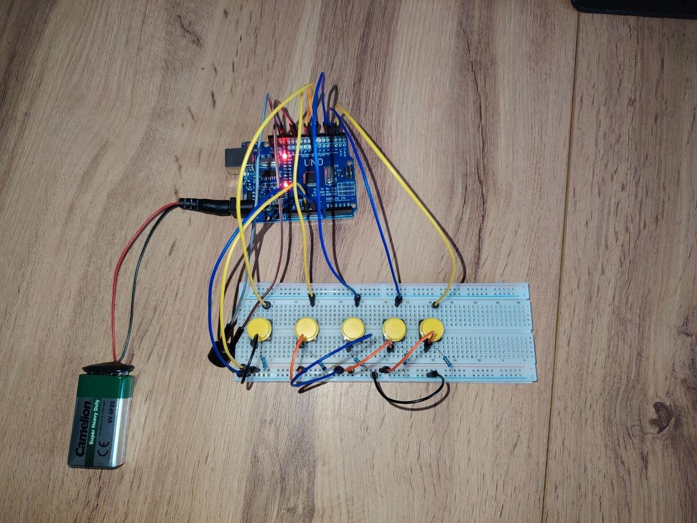
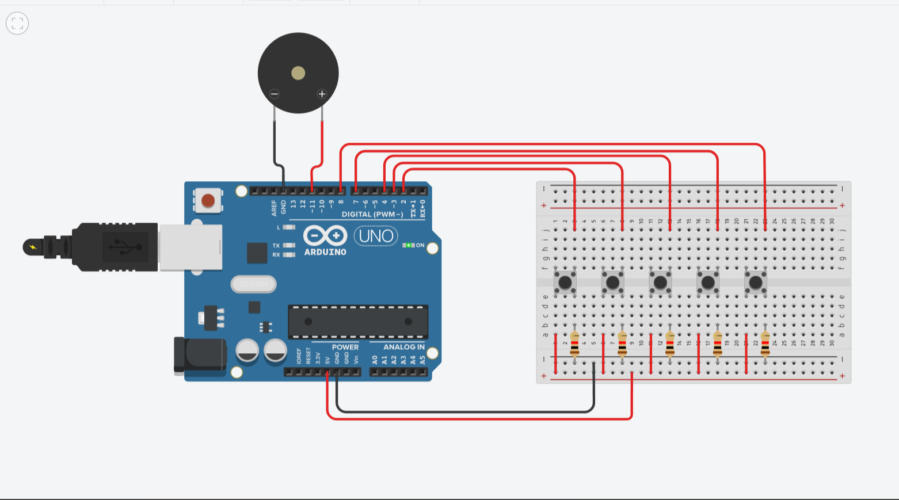

# 🎹 Пианино на Arduino

Простое пианино на 5 кнопок. Каждая кнопка играет свою ноту через пьезоизлучатель.

## 📸 Фото

## 📐 Схема

## 🛠️ Компоненты
- Arduino Uno
- Пьезоизлучатель
- 5 кнопок
- Провода
- Макетная плата

## 🔌 Подключение
| Пин Arduino | Кнопка |
|-------------|--------|
| D2 | DO (131 Гц) |
| D3 | RE (147 Гц) |
| D4 | MI (165 Гц) |
| D7 | FA (175 Гц) |
| D8 | SO (196 Гц) |
| D11 | Пьезоизлучатель |

## 💾 Установка
1. Скачайте `piano.ino`
2. Откройте в Arduino IDE
3. Загрузите на плату
2. Откройте в Arduino IDE
3. Загрузите на плату
